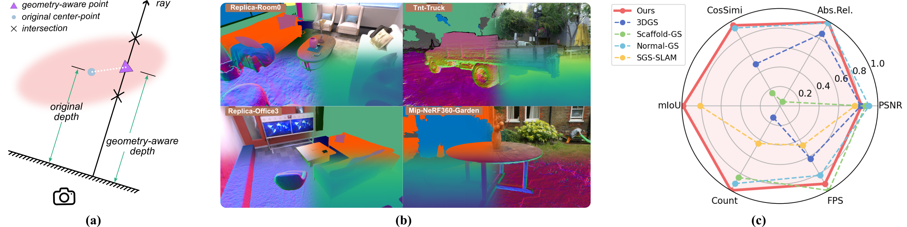
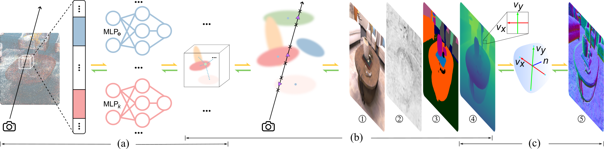
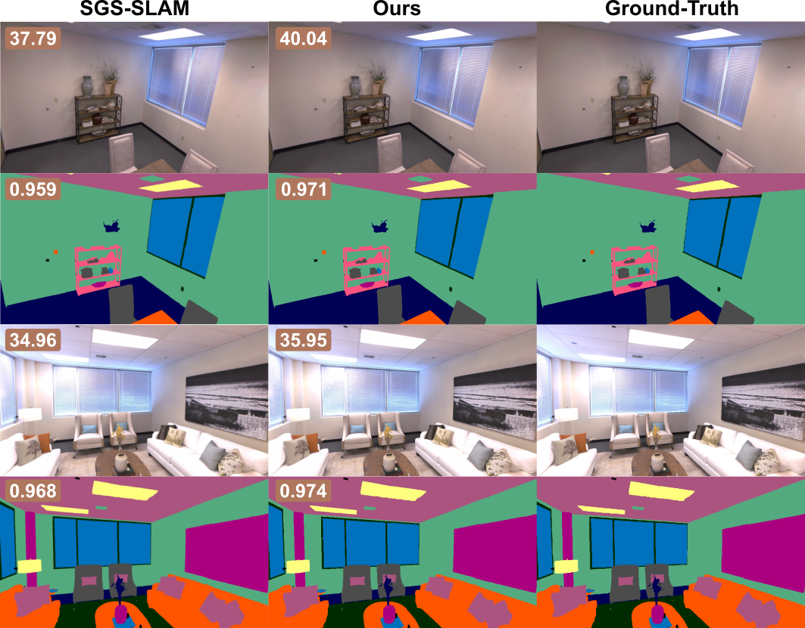
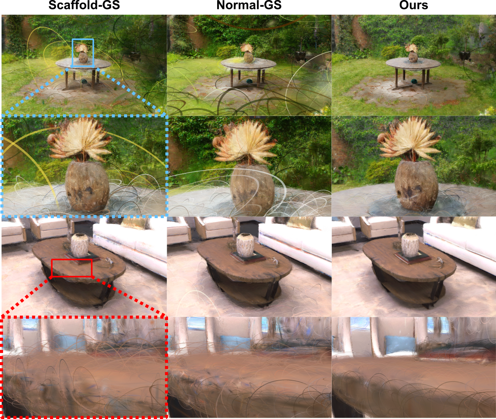
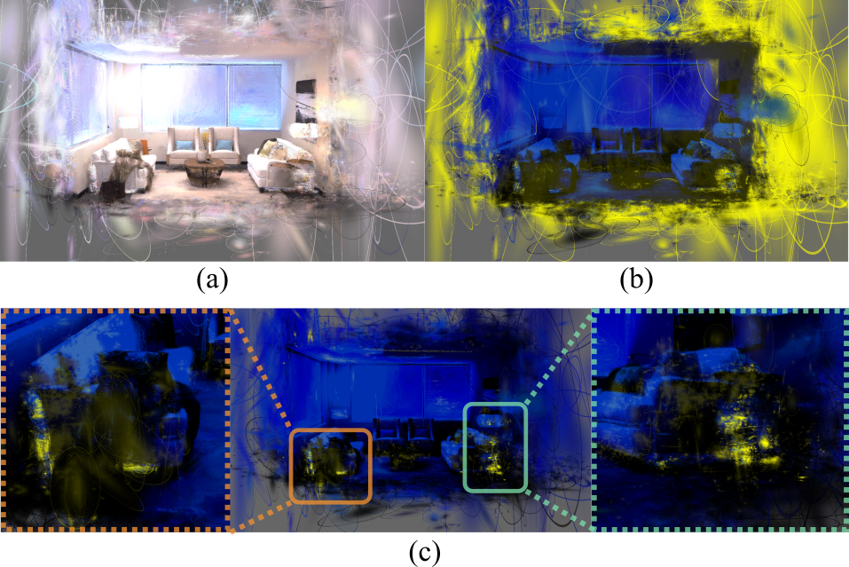
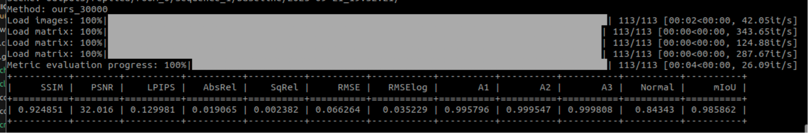
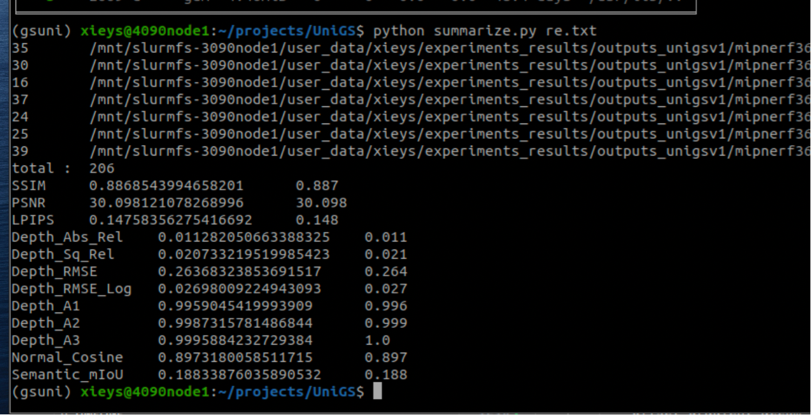

<p align="center">

  <h1 align="center">UniGS: Unified Geometry-Aware Gaussian Splatting for Multimodal Rendering</h1>
  <h3 align="center"><a href="https://arxiv.org/abs/2510.12174">Arxiv</a> | <a href="https://github.com/xieyuser/UniGS">Video (soon)</a> | <a href="https://github.com/xieyuser/gaussian-semantic-normal-rasterization">Multimodal CudaRasterizer</a> | <a href="https://github.com/xieyuser/SIBR_multimodal_viewer">Viewer</a> |  <a href="https://www.bilibili.com/video/BV1EdYyzbEXj/">Viewer Video</a> </h3>
  <div align="center"></div>
</p>


<div align="center">
<a href="https://github.com/xieyuser/UniGS" target="_blank"></a>
</div>


## Contributions

A. We develop a novel differentiable depth rasterization method based on ray-ellipsoid intersection, which enables optimization of Gaussian rotation and scale attributes via analytic gradients propagation. This approach ensures that Gaussian primitives conform closely to underlying surface geometries, significantly improving geometric consistency in reconstructed scenes.

B. We propose a trainable attribute in map representation for dynamically pruning insignificant Gaussians in a differentiable manner, which enhances rendering speed and storage efficiency.

C. We propose the first unified map representation and differentiable rasterization framework that integrates multi-modal data. This integration not only enables mutual enhancement across modalities but also improves rendering efficiency and strengthens the consistency of the reconstructed environment.

D. Through extensive experiments, we demonstrate that our method achieves state-of-the-art reconstruction accuracy across all modalities while consistently maintaining real-time performance. 

## 1.Overview
<div align="center">

</div>


## Images & Demo Video (soon)

<div align="center">

</div>

<div align="center">

</div>

<div align="center">

</div>


<div align="center">

</div>

<div align="center">

</div>

<div align="center">

</div>

## 2. Installization

``` bash
# clone
git clone https://github.com/xieyuser/UniGS.git --recursive

# environments
conda create -n unigs python=3.9
conda install --file conda_pkgs.txt

# build
cd UniGS/submodule/gaussian-semantic-normal-rasterization
python setup.py install
```

## 3. Datasets
The MipNeRF360 scenes are provided by the paper author [here](https://jonbarron.info/mipnerf360/). And we test on scenes ```bicycle, bonsai, counter, garden, kitchen, room, stump```. The SfM data sets for Tanks&Temples and Deep Blending are hosted by 3D-Gaussian-Splatting [here](https://repo-sam.inria.fr/fungraph/3d-gaussian-splatting/datasets/input/tandt_db.zip). 

### Custom Data

For custom data, you should process the image sequences with [Colmap](https://colmap.github.io/) to obtain the SfM points and camera poses. Then, place the results into ```data/``` folder.

Finally, create a ```data/``` folder inside the project path by 

```
mkdir data
```

The data structure will be organised as follows:

```
data/
├── dataset_name
│   ├── scene1/
│   │   ├── images
│   │   │   ├── IMG_0.jpg
│   │   │   ├── IMG_1.jpg
│   │   │   ├── ...
│   │   ├── sparse/
│   │       └──0/
│   ├── scene2/
│   │   ├── images
│   │   │   ├── IMG_0.jpg
│   │   │   ├── IMG_1.jpg
│   │   │   ├── ...
│   │   ├── sparse/
│   │       └──0/
...
```


## 4.Training & Evaluation


Training & rendering are same with Scaffold-GS.

We modify `metrics.py` to evaluate the performance of rendering. The result is shown as:

<div align="center">

</div>

After render all scenes, we use `summarize.py` to obtain average metric over all scenes.

```
find outputs/mipnerf360 -name "per_view.json" > re.txt
python summarize.py re.txt
```
The results will be summarized as follows：

<div align="center">

</div>

## Acknowledgments

Thanks for [Scaffold-GS](https://github.com/city-super/Scaffold-GS), [Normal-GS](https://github.com/Meng-Wei/Normal-GS.git), [3D Gaussian Splatting](https://github.com/graphdeco-inria/gaussian-splatting), 

<!-- ## Citation
```
@article{xie2024gslivm,
  title={{GS-LIVM: Real-Time Photo-Realistic LiDAR-Inertial-Visual Mapping with Gaussian Splatting}},
  author={Xie, Yusen and Huang, Zhenmin and Wu, Jin and Ma, Jun},
  journal={arXiv preprint arXiv:2410.17084},
  year={2024}
}
``` -->

## License
Please follow the LICENSE of [3D-GS](https://github.com/graphdeco-inria/gaussian-splatting).


## Cantact
For any technical issues, please feel free to contact yxie827@connect.hkust-gz.edu.cn.
